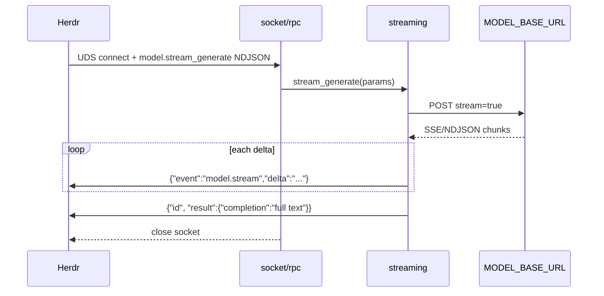
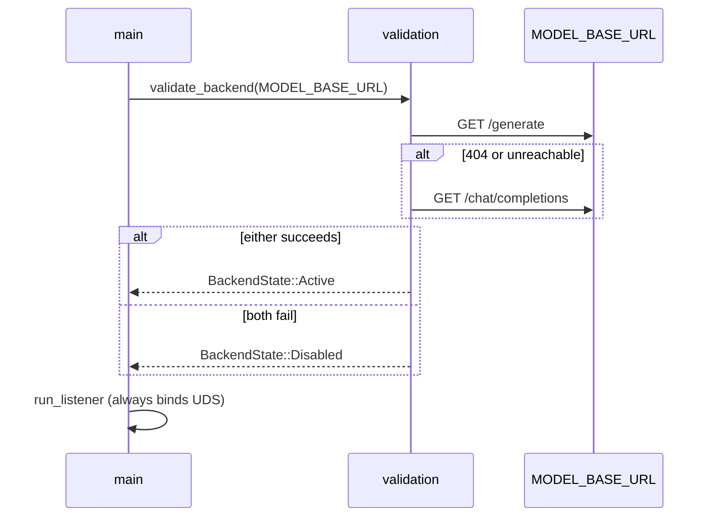

# Architecture

Single Tokio binary: Unix socket in, HTTP out. Startup validation fixes `BackendState` for the process lifetime; each accepted connection handles one RPC.

## Component table

| Module | File | Responsibility |
|--------|------|----------------|
| `main` | `src/main.rs` | Tracing init, require `HERDR_PLUGIN_SOCKET`, build HTTP client, read `MODEL_API_KEY`, run `validate_backend`, start listener |
| `validation` | `src/validation.rs` | Trim `MODEL_BASE_URL`, probe `/generate` then `/chat/completions`, produce `BackendState` |
| `socket` | `src/socket.rs` | Bind UDS, accept loop, spawn per-connection handler, one NDJSON read → RPC → close |
| `ndjson` | `src/ndjson.rs` | Read one JSON line / write line + optional flush |
| `rpc` | `src/rpc.rs` | Dispatch `model.info`, `model.generate`, `model.stream_generate`; encode result or error |
| `model` | `src/model.rs` | Map Herdr params → POST body by endpoint kind; parse non-stream completions |
| `http_client` | `src/http_client.rs` | Shared `reqwest::Client` (120s timeout), optional Bearer auth |
| `streaming` | `src/streaming.rs` | Stream POST, SSE/NDJSON delta parse, emit deltas, non-stream fallback |

## Backend state

```text
BackendState::Disabled { reason: String }
BackendState::Active { endpoint_url: String, kind: Generate | ChatCompletions }
```

- **Disabled:** Socket stays up; `model.info` advertises no generation tools.
- **Active:** Full tool list; generate and stream paths enabled against the probed URL.

## ASCII data flow

```text
┌─────────┐   UDS/NDJSON    ┌────────┐   dispatch   ┌─────────┐
│  Herdr  │ ──────────────► │ socket │ ───────────► │   rpc   │
└─────────┘                 └────────┘              └────┬────┘
     ▲                            │                      │
     │                            │                      ├── model.generate ──► model ──HTTP POST──► backend
     │                            │                      │
     │                            │                      └── model.stream_generate ──► streaming
     │                            │                                    │
     │         NDJSON deltas      │                                    ▼
     └────────────────────────────┴────────────────────────── http_client
                                                                  │
                     startup: validation ◄── GET probe ──────────┘
                               (BackendState)
```

## Connection lifecycle

```text
accept → read one NDJSON request line
      → handle_rpc (0..N write lines for streaming)
      → drop stream (socket closed)
```

Streaming RPCs may write many lines (one delta per flush) before the final result line.

## Mermaid: streaming sequence



## Mermaid: startup validation



## RPC methods (summary)

| Method | Active | Disabled |
|--------|--------|----------|
| `model.info` | Tools + endpoint metadata | Empty tools, `generation_enabled: false` |
| `model.generate` | Non-stream POST → `{completion}` | Error with disable reason |
| `model.stream_generate` | Deltas + final completion | Error with disable reason |
| other | Unknown method error | Unknown method error |

## Dependencies

- **tokio** — async runtime, `UnixListener`, I/O
- **reqwest** — HTTP with `bytes_stream` for streaming
- **serde / serde_json** — RPC and body JSON
- **tracing** — structured logs
- **anyhow** — error propagation at boundaries
- **futures-util** — stream iteration

## Related docs

- [FEATURES.md](FEATURES.md) — behavior by feature area
- [DIAGRAMS.md](DIAGRAMS.md) — additional Mermaid and ASCII diagrams
