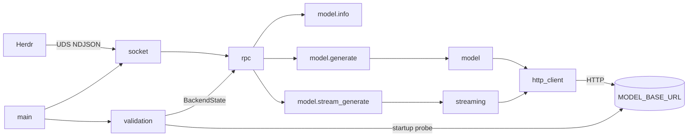
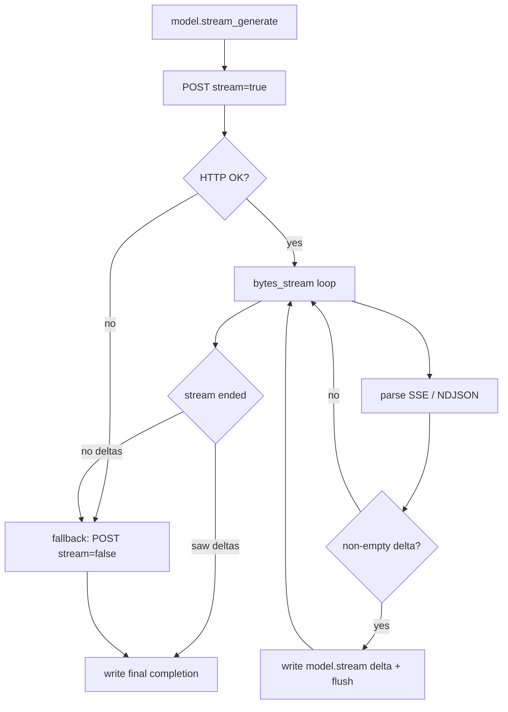
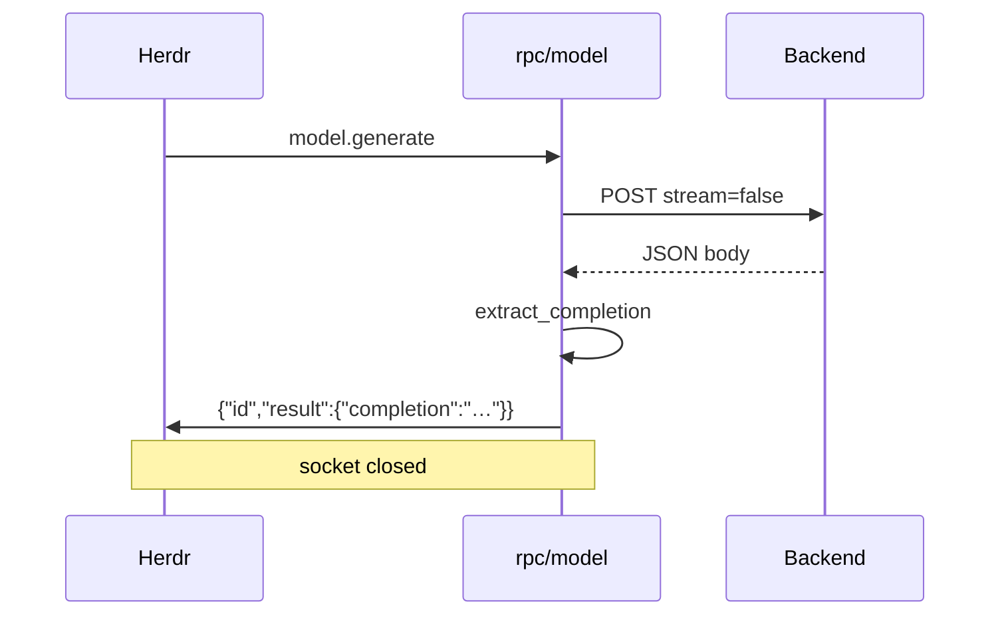
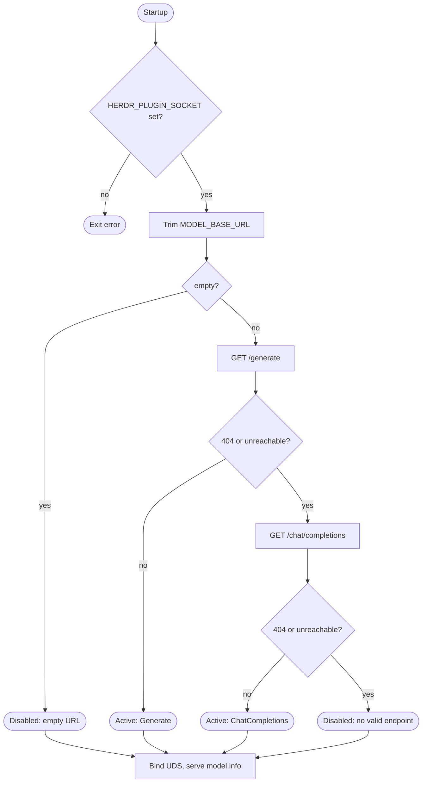
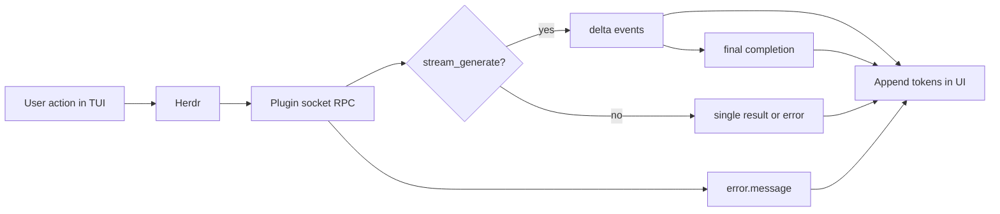

# Diagrams

Visual reference for `herdr-http-plugin`. Mermaid renders in GitHub and many Markdown viewers.

## Mermaid: architecture



## Mermaid: streaming flow



## Mermaid: non-streaming flow



## Mermaid: auto-disable decision tree



## Mermaid: TUI rendering flow



---

## ASCII: plugin architecture

```text
                    ┌─────────────────────────────────────┐
                    │           herdr-http-plugin           │
                    │  ┌─────────┐      ┌──────────────┐  │
                    │  │  main   │─────►│  validation  │  │
                    │  └────┬────┘      └──────────────┘  │
                    │       │                             │
                    │  ┌────▼────┐      ┌──────────────┐  │
                    │  │ socket  │─────►│     rpc      │  │
                    │  └─────────┘      └───┬──────┬───┘  │
                    │                       │      │      │
                    │              ┌────────▼──┐ ┌─▼──────┐ │
                    │              │  model  │ │streaming│ │
                    │              └────┬────┘ └────┬────┘ │
                    │                   └──────┬─────┘      │
                    │                    ┌─────▼─────┐     │
                    │                    │http_client│     │
                    │                    └─────┬─────┘     │
                    └──────────────────────────┼───────────┘
                                               │ HTTP
                                               ▼
                                         MODEL_BASE_URL
```

## ASCII: socket lifecycle

```text
  [Herdr spawns plugin]
         │
         ▼
  remove stale socket file (best effort)
         │
         ▼
  UnixListener::bind(HERDR_PLUGIN_SOCKET) ──fail──► exit (no TCP fallback)
         │
         ▼
  ┌────────────────── accept loop ──────────────────┐
  │  accept() ──► spawn task                        │
  │       read_line (one NDJSON request)              │
  │       handle_rpc ──► 1..N write lines           │
  │       drop stream (connection closed)             │
  └─────────────────────────────────────────────────┘
```

## ASCII: request/response flow

```text
REQUEST (one line):
  {"id":42,"method":"model.stream_generate","params":{"prompt":"hi"}}

RESPONSE (many lines possible):
  {"event":"model.stream","delta":"Hel"}
  {"event":"model.stream","delta":"lo"}
  {"id":42,"result":{"completion":"Hello"}}

ERROR (one line):
  {"id":42,"error":{"message":"model tools disabled: …"}}
```

## ASCII: picture-style — Herdr ↔ plugin ↔ cloud

```text
      .---.
     /     \          ╭──────────────────╮
    |  o o  |  Herdr  │  herdr-http-     │     ╭─────────╮
    |   ▽   │ ◄─UDS──►│  plugin          │─HTTP►│  LLM    │
     \     /          │  (NDJSON bridge) │     │  server │
      `---'           ╰──────────────────╯     ╰─────────╯
   "user at TUI"         "Rust Tokio bin"        "localhost:8000/v1"
```

## Related docs

- [ARCHITECTURE.md](ARCHITECTURE.md) — narrative architecture
- [FEATURES.md](FEATURES.md) — feature descriptions
- [TUI_USAGE.md](TUI_USAGE.md) — TUI behavior
